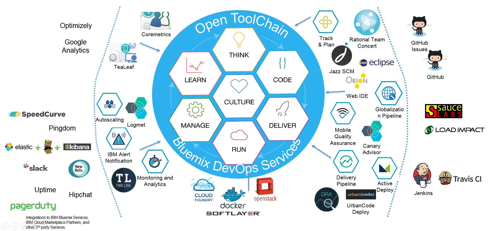
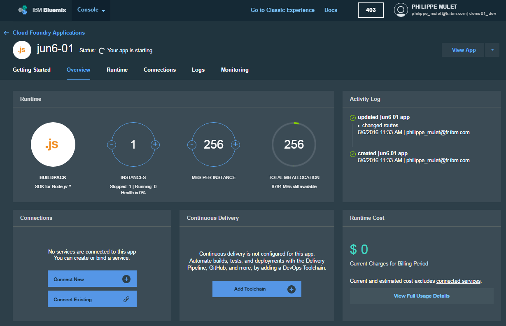
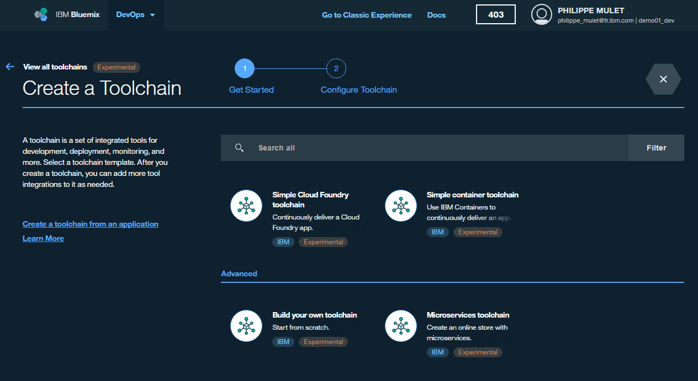
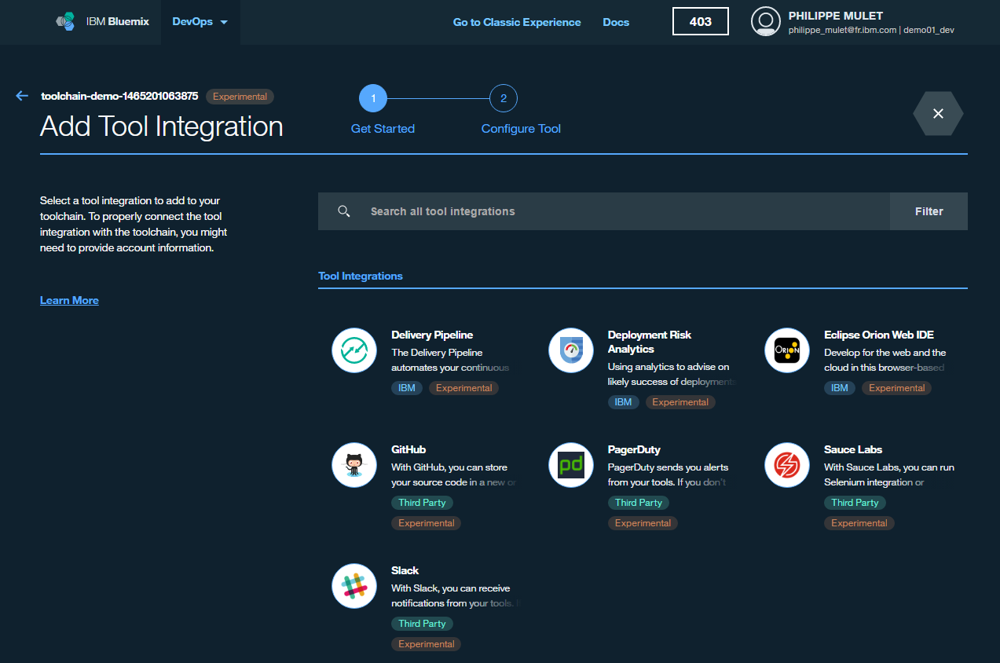

# Lab 1: Read Template Paper

## Objective
This lab is a reading exercise that will introduce you to some of the other ways to create and use Toolchains.

**Tasks**:
- [Review paper on using templates to create tool chains located here: https://ibm.biz/Bds4cG]( https://ibm.biz/Bds4cG)
**Tasks**:
- [Task 1: Review paper on using templates to create tool chains](#task-1-review-paper-on-using-templates-to-create-tool-chains)

## Task 1: Review paper on using templates to create tool chains

This is a reprint of the article located at: [https://ibm.biz/Bds4cG](https://ibm.biz/Bds4cG)

IBM® Bluemix® now automates the setup of DevOps toolchains that work well together in real-world projects. You no longer need to spend precious time assembling and maintaining tools from a rapidly evolving ecosystem; instead, you can maximize focus on your business objectives. You can create or clone toolchain templates and roll them out at scale to teams across your organization. You can then invite any number of users to your organization to grant them access to your toolchains.

You can try out a toolchain by clicking this [link](https://console.ng.bluemix.net/devops/setup/deploy/?repository=https%3A//github.com/open-toolchain/toolchain-demo.git).

The toolchain is for an online store application that consists of three microservices. It’s preconfigured for continuous delivery across multiple promotion environments, source control, blue-green deployment, functional testing, issue tracking, online editing, and messaging.

Alternatively, from the [DevOps dashboard tab](https://console.ng.bluemix.net/devops), click the **Toolchains** tab and click **Create a Toolchain**. The Microservices toolchain is one of the toolchain templates.

This evolution of IBM Bluemix DevOps Services is now an integral part of the Bluemix platform, and it is initially available on the public cloud (Bluemix Public). The toolchain technology is based on an open architecture, called _Open Toolchain_, that provides an API for integration of arbitrary tools, including IBM and third-party tools, either hosted in Bluemix or elsewhere, even in your enterprise network. Open Toolchain also provides the mechanics to define a toolchain from textual templates that can be automatically instantiated, and API support for analytics that can drive your DevOps intelligence.

You can get started with toolchains in Bluemix in several ways:

- Directly from an application’s Overview page, on the Continuous Delivery tile, click **Add Toolchain** to associate a continuous delivery toolchain for this application.

  Note: You can insert your own GitHub repository as part of this process.

  

- From the [Toolchains](http://console.ng.bluemix.net/devops) tab in Bluemix, you can find the toolchains for your organization and add more or use predefined templates by clicking the [add](https://console.ng.bluemix.net/devops/create) button.

  

  Templates are defined textually by using YAML syntax. The templates are stored in GitHub repositories, and they can be freely cloned and adjusted to fit your needs. The templates that are shown in the previous image are available in this GitHub organization: [https://github.com/open-toolchain](https://github.com/open-toolchain). You can clone or fork them as needed. Pull requests are welcome.

- From a **Create toolchain** button on a web page, readme file, blog post, or article that implements a toolchain when you click it. This functionality is like the [Deploy to Bluemix](https://developer.ibm.com/devops-services/2015/02/18/share-code-new-deploy-bluemix-button/) button.

In addition to the button that is provided in this blog post, you can see how the [Bluemix Garage Method](https://www.ibm.com/devops/method) is effectively turning microservices theory into practice with a [toolchain template](https://www.ibm.com/devops/method/toolchains/microservices_toolchain) and a button. The Bluemix Garage Method combines practices for successful cloud projects with advice on tools and toolchains for delivering applications in various problem domains.

After you create a toolchain, you can add more tool integrations to it, reconfigure the tool integrations, or remove a tool integration. To find the Tools Integration page, click the add button, which looks like a blue hexagon. The list of available integrations is expected to grow quickly.

Stay tuned for more information about the Open Toolchain SDK and template format. In the meantime, you can learn more and explore in many ways:

- Watch this [toolchains introduction video](https://www.youtube.com/embed/4fu5_f6VRAY).
- Learn more from the [toolchains documentation](https://console.ng.bluemix.net/docs/toolchains/toolchains_overview.html).
- Jump into the toolchain experience on Bluemix at [https://console.ng.bluemix.net/devops](https://console.ng.bluemix.net/devops). Let us know what you think by clicking the feedback link in the lower-right corner of the toolchain pages.

Enjoy toolchains on Bluemix!

Philippe Mulet
Lead Architect, IBM Bluemix DevOps Services
