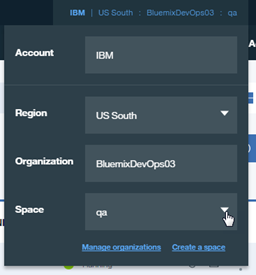
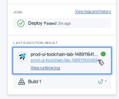
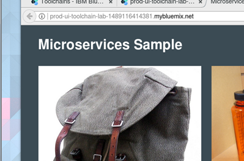

# Lab 4: Create UI Toolchain from Deployed App

## Objective
This lab manually deploys the UI microservice, creates a simple Toolchain from the deployed application and then configures the Toolchain.  It assumes that the _DevOpsLabs_ Organization and _dev_, _qa_ and _prod_ Spaces are already created.

**Tasks**:
- [Task 1: Deploy UI Application](#task-1-deploy-ui-application)
- [Task 2: Create Toolchain](#task-2-create-toolchain)
- [Task 3: Create Code Repo](#task-3-create-code-repo)
- [Task 4: Build Application](#task-4-build-application)

Throughout the lab, the phrase _timestamp_ is used to indicate the same timestamp string that was appended to _simple-order-toolchain_.  While a timestamp string is not required, it does help make the name of the created objects unique.

## Task 1: Deploy UI Application
1. If you are not already logged into IBM Bluemix, log into IBM Bluemix (https://www.ibm.com/cloud-computing/bluemix/).

3. Open a terminal Window by selecting **Activities**
from the panel and then select **Byobu Terminal**.

4. The sample code that you will be using is in a github repository. We will clone (make a copy) onto our local machine, In a terminal  window, enter the following command:
`git clone https://github.com/open-toolchain/Microservices_UI`
5. Change into the just created directory.
`cd Microservices_UI`
6. If you are curious, you can enter the ls command to see the files.
7. Login to Bluemix from the command line by entering the following command:
`cf login -a https://api.ng.bluemix.net -u userid@domain.com -o _org_name_ -s prod`
8. Push the application to Bluemix with the following command:
`cf push prod-ui-toolchain-lab-timestamp`

## Task 2: Create Toolchain

1. Return to the Bluemix console.
2. If you are not on the Toolchains page (if you don't see a button called _Create a Toolchain_), click on the **Bluemix menu bar** in the upper left corner.

and click on **Services** then **DevOps**

and click on **Toolchains**.
2. Click **Create a Toolchain**.
3. Click on **Create a toolchain from an application**.
4. Click on the application to display the application dashboard.
5. If the _prod_ space is not displayed in the upper right hand corner, click the upper-right hand corner account settings and select **prod** as the _Space_.

5. Click on your (just created) application to display the application overview page.

6. Click on the **Enable** button for _Continuous Delivery_.

7. The Continuous Delivery Toolchain creation page is displayed and pre-filled with information about the application.

8. Click **Create**.  The Toolchain is created.

## Task 3: Create Code Repo

We need to create a repo and link that to the Toolchain (remember, we just cloned the repo locally).

1. In the Toolchain, click on the GitHub tile.

 to display the GitHub repo.
2. Click the **Import Code** button to import the code from the original repo.

3. Enter **https://github.com/open-toolchain/Microservices_UI** as the clone URL.

4. Click **Begin Importe**.
5. Wait for the import to complete.

6. Close the GitHub browser tab.
7. Close the Bluemix application dashboard browser tab.

## Task 4: Build Application

1. On the Bluemix _Create a Toolchain_ page, click the blue arrow to the left of _Toolchains_ to return to the Toolchains.
2. Click the just created Toolchain _(prod-ui-toolchain-lab-timestamp)_.
2. Click on the _Delivery Pipeline_ tile.
3. Run the _Build Stage_.
4. The _Build_ and _Deploy_ stages complete (the _Deploy Stage_ was started as a result of the _Build Stage_ running).

5. Click on the application URL.

6. Assuming the microservices names match up, the application works.  If not, don't worry, somewhere along the way the <b><i>timestamp</i></b> may have been mistyped.

7. If you wish, you can add more jobs or stages.
